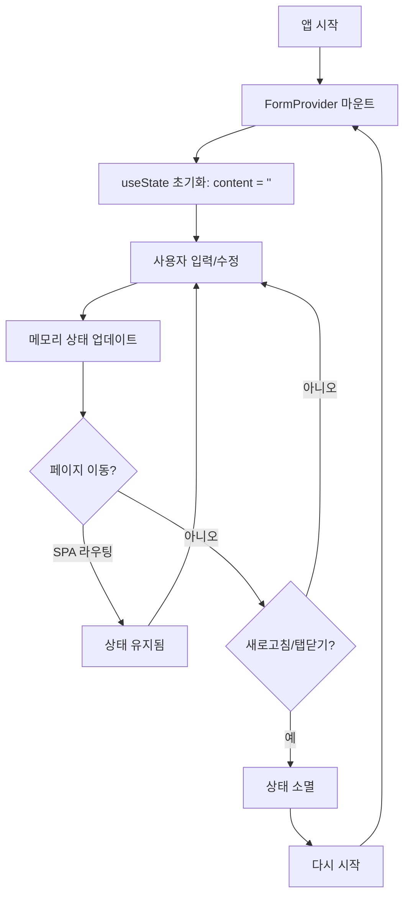
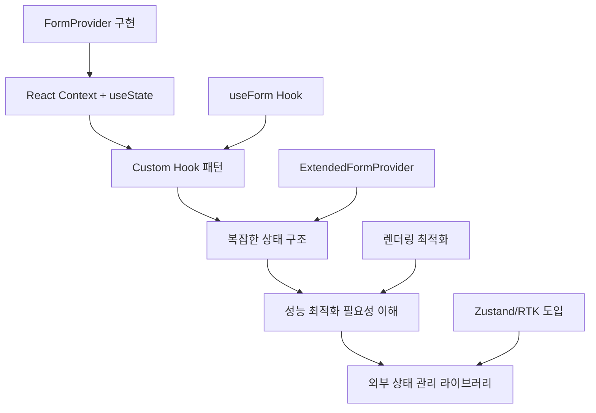

# FormProvider와 클라이언트 상태 관리 라이브러리 비교 분석

## 개요

현재 프로젝트에서는 **FormProvider**(React Context 기반)가 클라이언트 상태 관리 역할을 담당하고 있습니다. 이 문서에서는 FormProvider의 역할과 다른 클라이언트 상태 관리 라이브러리(Zustand, Redux Toolkit)와의 비교 분석을 다룹니다.

## 상태 관리 구조 이해

### 1. 현재 프로젝트의 상태 관리 아키텍처

```typescript
// App.tsx - 현재 구조
<QueryClientProvider client={queryClient}>    // 🟠 서버 상태 관리 (TanStack Query)
  <FormProvider>                               // 🔵 클라이언트 상태 관리 (React Context)
    <BrowserRouter>
      <Routes>...</Routes>
    </BrowserRouter>
  </FormProvider>
</QueryClientProvider>
```

**역할 분담:**
- **QueryClientProvider + TanStack Query**: 서버 상태 (API 데이터, 캐싱, 동기화)
- **FormProvider + React Context**: 클라이언트 상태 (폼 데이터, UI 상태, 페이지 간 공유)

### 2. 클라이언트 상태 vs 서버 상태

```typescript
// 🔵 클라이언트 상태 (FormProvider가 관리)
const [content, setContent] = useState('');           // 폼 입력값
const [isModalOpen, setIsModalOpen] = useState(false); // UI 상태
const [currentTheme, setCurrentTheme] = useState('dark'); // 사용자 설정

// 🟠 서버 상태 (TanStack Query가 관리)
const { data: users } = useQuery(['users'], fetchUsers);     // API 데이터
const { data: posts } = useQuery(['posts'], fetchPosts);     // 서버에서 가져온 데이터
```

## FormProvider 상세 분석

### 1. 기본 FormProvider 구조

```typescript
// FormContext.tsx
interface FormContextType {
  content: string;
  setContent: (content: string) => void;
  clearContent: () => void;
  getContentLength: () => number;
}

export function FormProvider({ children }: FormProviderProps) {
  const [content, setContent] = useState<string>('');

  const clearContent = () => {
    setContent('');
  };

  const getContentLength = () => {
    return content.length;
  };

  const contextValue: FormContextType = {
    content,
    setContent,
    clearContent,
    getContentLength,
  };

  return (
    <FormContext.Provider value={contextValue}>
      {children}
    </FormContext.Provider>
  );
}

// 사용법
export function useForm(): FormContextType {
  const context = useContext(FormContext);
  
  if (context === undefined) {
    throw new Error('useForm must be used within a FormProvider');
  }
  
  return context;
}
```

**제공하는 기능:**
- ✅ **전역 폼 상태**: `content` 문자열 전역 관리
- ✅ **상태 조작**: `setContent()`, `clearContent()` 함수
- ✅ **유틸리티**: `getContentLength()` 계산 함수
- ✅ **타입 안전성**: TypeScript 완전 지원
- ✅ **에러 처리**: Provider 외부 사용 시 에러 발생

### 2. 확장된 FormProvider (ExtendedFormProvider)

```typescript
interface ExtendedFormData {
  title: string;
  content: string;
  category: string;
  tags: string[];
  isDraft: boolean;
  lastSaved: Date | null;
}

interface ExtendedFormContextType {
  formData: ExtendedFormData;
  updateField: <K extends keyof ExtendedFormData>(field: K, value: ExtendedFormData[K]) => void;
  resetForm: () => void;
  saveAsDraft: () => void;
}

export function ExtendedFormProvider({ children }: FormProviderProps) {
  const [formData, setFormData] = useState<ExtendedFormData>(initialFormData);

  const updateField = <K extends keyof ExtendedFormData>(
    field: K, 
    value: ExtendedFormData[K]
  ) => {
    setFormData(prev => ({
      ...prev,
      [field]: value,
      lastSaved: new Date(),
    }));
  };

  const resetForm = () => {
    setFormData(initialFormData);
  };

  const saveAsDraft = () => {
    setFormData(prev => ({
      ...prev,
      isDraft: true,
      lastSaved: new Date(),
    }));
  };
}
```

**고급 기능:**
- ✅ **복잡한 데이터 구조**: 객체와 배열 지원
- ✅ **타입 안전한 업데이트**: 제네릭을 활용한 필드 업데이트
- ✅ **메타데이터 관리**: 저장 시간, 임시저장 상태
- ✅ **자동 타임스탬프**: 변경 시 자동으로 lastSaved 업데이트

### 3. 실제 사용 사례

**PageCachingPage.tsx에서 활용:**
```typescript
import { useForm } from '../contexts/FormContext';

export default function PageCachingPage() {
  const { content, setContent, clearContent, getContentLength } = useForm();

  const handleInputChange = (e: React.ChangeEvent<HTMLTextAreaElement>) => {
    setContent(e.target.value);
  };

  return (
    <div>
      <textarea
        value={content}
        onChange={handleInputChange}
        placeholder="페이지 간 공유되는 내용을 입력하세요..."
      />
      <p>입력된 글자 수: {getContentLength()}</p>
      <button onClick={clearContent}>내용 지우기</button>
    </div>
  );
}
```

**핵심 특징:**
- **페이지 간 상태 공유**: 다른 페이지로 이동해도 입력 내용 유지
- **실시간 업데이트**: 글자 수 자동 계산
- **상태 초기화**: 명확한 상태 리셋 기능

## FormProvider 데이터 생명주기

### 1. 메모리 기반 상태 관리 특성

```typescript
// FormProvider는 React의 useState를 사용
export function FormProvider({ children }: FormProviderProps) {
  const [content, setContent] = useState<string>(''); // 메모리에 저장
  
  // 이 상태는 JavaScript 메모리에만 존재
  // 브라우저 새로고침 시 초기화됨
}
```

**생명주기 특징:**
- ✅ **메모리 기반**: JavaScript 힙 메모리에 저장
- ✅ **빠른 접근**: 디스크 I/O 없이 즉시 접근
- ⚠️ **휘발성**: 애플리케이션 종료 시 소멸
- ⚠️ **세션 의존적**: 브라우저 세션과 생명주기 동일

### 2. 생명주기 단계별 분석

#### **🟢 생성 (Creation) - 애플리케이션 시작**
```typescript
// 1. 애플리케이션 시작 시
<QueryClientProvider>
  <FormProvider>  // ← 이 순간 useState('')로 빈 문자열 초기화
    <App />
  </FormProvider>
</QueryClientProvider>

// 2. 초기 상태
const initialState = {
  content: '',           // 빈 문자열
  lastUpdated: null,     // 업데이트 없음
  inMemory: true         // 메모리에만 존재
}
```

#### **🔄 활성 상태 (Active State) - 사용자 상호작용**
```typescript
// 페이지에서 데이터 조작
function PageCachingPage() {
  const { content, setContent } = useForm();
  
  const handleChange = (e) => {
    setContent(e.target.value); // 메모리 상태 업데이트
  };
  
  // 페이지 간 이동해도 데이터 유지
  // /page-caching → /home → /page-caching (데이터 그대로 있음)
}
```

#### **⚠️ 소멸 조건들 (Destruction Scenarios)**

**즉시 소멸:**
```typescript
// 1. 브라우저 새로고침 (F5, Ctrl+R)
// Before: content = "사용자가 입력한 텍스트"
// 새로고침 실행
// After: content = "" (초기값으로 리셋)

// 2. 브라우저 탭 닫기
// 3. 새 탭에서 페이지 열기 (별도 메모리 공간)
// 4. 브라우저 완전 종료
```

### 3. 상세한 생명주기 시나리오

#### **✅ 데이터가 유지되는 경우**

```typescript
// 시나리오 1: 페이지 간 이동 (SPA 내부 라우팅)
사용자 입력: "안녕하세요" → /page-caching
페이지 이동: /page-caching → /home  (content: "안녕하세요" 메모리 유지)
다시 이동: /home → /page-caching    (content: "안녕하세요" 그대로 표시)

// 시나리오 2: 브라우저 뒤로가기/앞으로가기
/page-caching (입력) → /home (뒤로가기) → /page-caching (앞으로가기)
→ 데이터 유지됨 ✅

// 시나리오 3: URL 직접 변경 (같은 탭 내)
주소창에서 /page-caching → /dnd → /page-caching
→ 데이터 유지됨 ✅
```

#### **❌ 데이터가 소멸되는 경우**

```typescript
// 시나리오 1: 브라우저 새로고침
content: "안녕하세요" 
→ F5 또는 Ctrl+R
→ content: "" (초기화됨)

// 시나리오 2: 새 탭/창 열기
Tab1: content: "안녕하세요"
→ 새 탭에서 같은 URL 열기
→ Tab2: content: "" (별도 메모리 공간, 독립적)

// 시나리오 3: 브라우저 종료 후 재시작
브라우저 종료 → 재시작 → 사이트 방문
→ content: "" (완전 초기화)

// 시나리오 4: 페이지 직접 이동 (외부 링크)
다른 사이트 → 뒤로가기로 돌아옴
→ content: "" (페이지 재로드됨)
```

### 4. 생명주기 다이어그램



### 5. 메모리 vs 영구 저장소 비교

#### **현재 FormProvider (메모리 기반)**
```typescript
// 장점
✅ 빠른 접근 속도 (0ms 지연)
✅ 자동 가비지 컬렉션 (메모리 관리 자동)
✅ 보안성 (메모리에만 존재, 디스크 흔적 없음)
✅ 단순한 구현 (useState만 사용)

// 단점  
❌ 새로고침 시 소멸
❌ 탭 간 공유 불가
❌ 브라우저 종료 시 소멸
❌ 실수로 인한 데이터 손실 위험
```

#### **영구 저장소와 결합한다면**
```typescript
// 개선된 FormProvider (예시)
export function PersistentFormProvider({ children }) {
  const [content, setContentState] = useState(() => {
    // 초기값을 localStorage에서 가져오기
    try {
      return localStorage.getItem('form-content') || '';
    } catch {
      return ''; // localStorage 접근 실패 시 기본값
    }
  });

  const setContent = (newContent) => {
    setContentState(newContent);
    try {
      localStorage.setItem('form-content', newContent); // 영구 저장
    } catch (error) {
      console.warn('localStorage 저장 실패:', error);
    }
  };

  const clearContent = () => {
    setContentState('');
    try {
      localStorage.removeItem('form-content');
    } catch (error) {
      console.warn('localStorage 삭제 실패:', error);
    }
  };

  // 장점: 새로고침 후에도 데이터 유지 ✅
  // 단점: 구현 복잡도 증가, 용량 제한 (5-10MB), 에러 처리 필요
}
```

### 6. 생명주기 모니터링 및 디버깅

**개발자 도구에서 확인 방법:**

```typescript
// 1. 커스텀 로깅 추가
export function FormProvider({ children }) {
  const [content, setContent] = useState('');
  
  useEffect(() => {
    console.log('🟢 FormProvider 마운트됨');
    return () => console.log('🔴 FormProvider 언마운트됨');
  }, []);
  
  useEffect(() => {
    console.log('📝 Content 변경됨:', content, 'at', new Date().toISOString());
  }, [content]);
  
  // 메모리 사용량 모니터링 (개발환경)
  useEffect(() => {
    if (process.env.NODE_ENV === 'development') {
      const checkMemory = () => {
        if (performance.memory) {
          console.log('메모리 사용량:', {
            used: Math.round(performance.memory.usedJSHeapSize / 1024 / 1024) + 'MB',
            total: Math.round(performance.memory.totalJSHeapSize / 1024 / 1024) + 'MB'
          });
        }
      };
      
      const interval = setInterval(checkMemory, 10000); // 10초마다 체크
      return () => clearInterval(interval);
    }
  }, []);
}

// 2. React DevTools에서 확인
// - Components 탭에서 FormProvider 상태 실시간 확인
// - Profiler 탭에서 리렌더링 패턴 분석

// 3. 브라우저 메모리 분석
// - Performance 탭에서 메모리 사용량 추적
// - Memory 탭에서 Heap 스냅샷 비교
```

### 7. 다른 상태 관리 라이브러리와 생명주기 비교

| 방식 | 생명주기 범위 | 새로고침 후 유지 | 탭 간 공유 | 저장 위치 |
|------|---------------|------------------|------------|-----------|
| **FormProvider** | 앱 실행 중 | ❌ | ❌ | 메모리 |
| **Zustand (기본)** | 앱 실행 중 | ❌ | ❌ | 메모리 |
| **Zustand + persist** | 설정에 따라 | ✅ | ✅ | localStorage |
| **Redux (기본)** | 앱 실행 중 | ❌ | ❌ | 메모리 |
| **Redux + persist** | 설정에 따라 | ✅ | ✅ | localStorage |
| **localStorage** | 수동 삭제까지 | ✅ | ✅ | 디스크 |
| **sessionStorage** | 탭 닫기까지 | ❌ | ❌ | 디스크 |

### 8. 현재 프로젝트에서 생명주기의 의미

#### **교육/데모 목적에 최적화된 생명주기**
```typescript
✅ 페이지 간 이동 시 상태 유지 → 사용자 경험 학습
✅ 새로고침 시 초기화 → 깔끔한 데모 환경
✅ 메모리 기반 → 빠른 응답성으로 학습 집중도 향상
✅ 단순한 구현 → 핵심 개념 학습에 집중
```

**실제 프로젝트 문서에서 언급:**
> "브라우저 새로고침 시에는 메모리에서 상태가 초기화됩니다. 완전한 지속성을 위해서는 localStorage나 sessionStorage를 함께 사용해야 합니다."

#### **실제 서비스라면 고려할 점**
```typescript
// 사용자 경험 문제점
❌ 새로고침으로 입력 내용 사라짐 → 사용자 불만
❌ 실수로 탭 닫기 → 작업 내용 손실  
❌ 브라우저 크래시 → 복구 불가능

// 해결책: 하이브리드 접근
- 메모리 상태 (빠른 접근) + localStorage (영구 보관)
- 자동 저장 기능 (draft 저장)
- 복구 알림 기능 (이전 세션 복원 제안)
- 사용자 동의 하에 데이터 보관 (GDPR 준수)
```

### 9. 생명주기 최적화 패턴

**현재 프로젝트 수준:**
```typescript
// 단순한 메모리 상태 관리
const [content, setContent] = useState('');
// 장점: 구현 단순, 학습 집중
// 단점: 데이터 손실 위험
```

**실무 적용 시 고려할 패턴:**
```typescript
// 하이브리드 패턴 (메모리 + 영구 저장)
const usePersistedState = (key, defaultValue) => {
  const [state, setState] = useState(() => {
    const saved = localStorage.getItem(key);
    return saved ? JSON.parse(saved) : defaultValue;
  });
  
  const setValue = (value) => {
    setState(value);
    localStorage.setItem(key, JSON.stringify(value));
  };
  
  return [state, setValue];
};
```

## 클라이언트 상태 관리 라이브러리 비교

### 1. FormProvider (React Context) - 현재 사용

**장점:**
- ✅ **Zero Dependencies**: React 내장 기능만 사용
- ✅ **학습 목적**: Context API와 Hook 패턴 학습 가능
- ✅ **타입 안전성**: TypeScript 완전 지원
- ✅ **단순성**: 간단한 상태에 최적화
- ✅ **교육적 가치**: React 기본 개념 이해에 도움

**단점:**
- ❌ **성능 이슈**: Context 변경 시 모든 하위 컴포넌트 리렌더링
- ❌ **복잡한 상태 부적합**: 중첩된 객체나 복잡한 로직 처리 어려움
- ❌ **개발자 도구 부족**: 상태 디버깅 도구 없음
- ❌ **보일러플레이트**: Provider 설정과 Hook 작성 필요

### 2. Zustand - 경량 대안

```typescript
import { create } from 'zustand'

// 기본 사용법
const useFormStore = create((set, get) => ({
  content: '',
  setContent: (content) => set({ content }),
  clearContent: () => set({ content: '' }),
  getContentLength: () => get().content.length,
}))

// 복잡한 상태 관리
const useAppStore = create((set) => ({
  // 상태
  user: null,
  theme: 'light',
  sidebarOpen: false,
  
  // 액션
  setUser: (user) => set({ user }),
  toggleTheme: () => set((state) => ({ 
    theme: state.theme === 'light' ? 'dark' : 'light' 
  })),
  toggleSidebar: () => set((state) => ({ 
    sidebarOpen: !state.sidebarOpen 
  })),
}))

// 컴포넌트에서 사용
function MyComponent() {
  const { content, setContent } = useFormStore();
  const { theme, toggleTheme } = useAppStore();
  
  return (
    <div>
      <input 
        value={content} 
        onChange={(e) => setContent(e.target.value)} 
      />
      <button onClick={toggleTheme}>
        테마 변경 ({theme})
      </button>
    </div>
  );
}
```

**장점:**
- ✅ **경량**: ~2KB 크기
- ✅ **성능**: 선택적 리렌더링 최적화
- ✅ **단순한 API**: 학습 곡선 낮음
- ✅ **TypeScript 지원**: 완전한 타입 추론
- ✅ **DevTools**: Redux DevTools 호환
- ✅ **미들웨어**: persist, immer 등 확장 가능

**단점:**
- ❌ **외부 의존성**: 추가 라이브러리 필요
- ❌ **생태계**: Redux에 비해 작은 생태계
- ❌ **복잡한 로직**: 매우 복잡한 상태 로직에는 부적합

### 3. Redux Toolkit (RTK) - 강력한 대안

```typescript
import { createSlice, configureStore } from '@reduxjs/toolkit'

// 슬라이스 생성
const formSlice = createSlice({
  name: 'form',
  initialState: {
    content: '',
  },
  reducers: {
    setContent: (state, action) => {
      state.content = action.payload;
    },
    clearContent: (state) => {
      state.content = '';
    },
  },
})

const uiSlice = createSlice({
  name: 'ui',
  initialState: {
    theme: 'light',
    sidebarOpen: false,
  },
  reducers: {
    toggleTheme: (state) => {
      state.theme = state.theme === 'light' ? 'dark' : 'light';
    },
    toggleSidebar: (state) => {
      state.sidebarOpen = !state.sidebarOpen;
    },
  },
})

// 스토어 구성
const store = configureStore({
  reducer: {
    form: formSlice.reducer,
    ui: uiSlice.reducer,
  },
})

// 액션과 선택자 export
export const { setContent, clearContent } = formSlice.actions;
export const { toggleTheme, toggleSidebar } = uiSlice.actions;

// 컴포넌트에서 사용
import { useSelector, useDispatch } from 'react-redux'

function MyComponent() {
  const content = useSelector((state) => state.form.content);
  const theme = useSelector((state) => state.ui.theme);
  const dispatch = useDispatch();
  
  return (
    <div>
      <input 
        value={content} 
        onChange={(e) => dispatch(setContent(e.target.value))} 
      />
      <button onClick={() => dispatch(toggleTheme())}>
        테마 변경 ({theme})
      </button>
    </div>
  );
}
```

**장점:**
- ✅ **강력함**: 복잡한 상태 로직 처리 최적
- ✅ **예측 가능성**: 불변성과 순수 함수
- ✅ **개발자 도구**: 최고의 디버깅 경험
- ✅ **미들웨어**: 비동기, 로깅, 퍼시스트 등
- ✅ **생태계**: 방대한 생태계와 커뮤니티
- ✅ **타임 트래블**: 상태 변경 히스토리 추적

**단점:**
- ❌ **복잡성**: 높은 학습 곡선
- ❌ **보일러플레이트**: 많은 설정 코드
- ❌ **번들 크기**: 상대적으로 큰 크기
- ❌ **과잉**: 단순한 상태에는 과도함

## 상세 비교 분석

### 1. 기능 비교표

| 기능 | FormProvider | Zustand | Redux Toolkit |
|------|--------------|---------|---------------|
| **번들 크기** | 0KB (내장) | ~2KB | ~15KB |
| **학습 곡선** | 낮음 | 낮음 | 높음 |
| **타입 안전성** | ✅ 완전 | ✅ 완전 | ✅ 완전 |
| **성능** | ⚠️ Context 이슈 | ✅ 최적화됨 | ✅ 최적화됨 |
| **개발자 도구** | ❌ 없음 | ✅ Redux DevTools | ✅ 최고의 도구 |
| **미들웨어** | ❌ 수동 구현 | ✅ 확장 가능 | ✅ 풍부한 생태계 |
| **복잡한 로직** | ❌ 부적합 | ⚠️ 중간 | ✅ 최적 |
| **비동기 처리** | ❌ 수동 구현 | ⚠️ 기본 지원 | ✅ RTK Query |

### 2. 사용 사례별 권장사항

**🏠 소규모 프로젝트 (현재 프로젝트와 같은):**
```typescript
// FormProvider (React Context) - 권장
✅ 교육/학습 목적
✅ 단순한 폼 상태
✅ 외부 의존성 최소화
✅ React 기본 개념 학습
```

**🏢 중규모 프로젝트:**
```typescript
// Zustand - 권장
✅ 빠른 개발 속도
✅ 적당한 복잡도
✅ 성능 최적화 필요
✅ 경량 솔루션 선호
```

**🏭 대규모 프로젝트:**
```typescript
// Redux Toolkit - 권장
✅ 복잡한 비즈니스 로직
✅ 팀 협업 중요
✅ 예측 가능한 상태 관리
✅ 강력한 디버깅 필요
```

### 3. 성능 비교

**렌더링 최적화:**

```typescript
// FormProvider - Context 문제
const FormProvider = ({ children }) => {
  const [content, setContent] = useState('');
  
  // content 변경 시 모든 하위 컴포넌트 리렌더링 발생 가능
  return (
    <FormContext.Provider value={{ content, setContent }}>
      {children}  {/* 모든 자식이 리렌더링될 수 있음 */}
    </FormContext.Provider>
  );
};

// Zustand - 선택적 렌더링
const useFormStore = create((set) => ({
  content: '',
  count: 0,
  setContent: (content) => set({ content }),
  incrementCount: () => set((state) => ({ count: state.count + 1 })),
}));

function ComponentA() {
  const content = useFormStore((state) => state.content); // content 변경시만 리렌더링
  return <div>{content}</div>;
}

function ComponentB() {
  const count = useFormStore((state) => state.count); // count 변경시만 리렌더링
  return <div>{count}</div>;
}
```

## 마이그레이션 시나리오

### 1. FormProvider → Zustand 마이그레이션

**현재 (FormProvider):**
```typescript
// FormContext.tsx
export function FormProvider({ children }) {
  const [content, setContent] = useState('');
  // ... 구현
}

// 사용
const { content, setContent } = useForm();
```

**마이그레이션 후 (Zustand):**
```typescript
// formStore.ts
import { create } from 'zustand'

export const useFormStore = create((set) => ({
  content: '',
  setContent: (content) => set({ content }),
  clearContent: () => set({ content: '' }),
  getContentLength: () => get().content.length,
}))

// 사용 (거의 동일한 API)
const { content, setContent } = useFormStore();
```

**마이그레이션 장점:**
- ✅ API 호환성: 거의 동일한 사용법
- ✅ 성능 향상: 선택적 리렌더링
- ✅ 개발자 도구: 상태 디버깅 가능
- ✅ 확장성: 더 복잡한 로직 추가 가능

### 2. 점진적 마이그레이션 전략

**1단계: Zustand 도입**
```typescript
// 기존 FormProvider 유지하면서 Zustand 병행 사용
<QueryClientProvider>
  <FormProvider>           // 기존 유지
    <ZustandProvider>      // 새로 추가
      <App />
    </ZustandProvider>
  </FormProvider>
</QueryClientProvider>
```

**2단계: 새 기능은 Zustand 사용**
```typescript
// 새로운 상태는 Zustand로
const useUIStore = create((set) => ({
  theme: 'light',
  sidebarOpen: false,
  // 새 기능들...
}));

// 기존 폼 상태는 FormProvider 유지
const { content } = useForm();
```

**3단계: FormProvider 완전 교체**
```typescript
// FormProvider 제거 후 Zustand로 통합
<QueryClientProvider>
  <App />  // Zustand는 Provider 불필요
</QueryClientProvider>
```

## 교육적 가치 분석

### 1. FormProvider의 학습 가치

**React 핵심 개념 학습:**
- ✅ **Context API**: React의 상태 공유 메커니즘 이해
- ✅ **Custom Hook**: 재사용 가능한 로직 분리
- ✅ **TypeScript 통합**: 타입 안전한 상태 관리
- ✅ **Provider 패턴**: 컴포넌트 합성과 의존성 주입

**실무 패턴 학습:**
```typescript
// Context + Hook 패턴
const Context = createContext();
export const Provider = ({ children }) => {
  // 상태 로직
  return <Context.Provider>{children}</Context.Provider>;
};
export const useCustomHook = () => {
  const context = useContext(Context);
  if (!context) throw new Error('...');
  return context;
};
```

### 2. 학습 로드맵

**초급 → 중급 → 고급:**


## 실제 프로젝트 적용 가이드

### 1. 현재 프로젝트에 적합한 이유

**교육용 프로젝트 특성:**
- ✅ **학습 중심**: React 기본 개념 습득이 목표
- ✅ **단순한 상태**: 복잡한 비즈니스 로직 없음
- ✅ **의존성 최소화**: 핵심 라이브러리에 집중
- ✅ **타입 안전성**: TypeScript 학습과 병행

**실제 사용 패턴:**
```typescript
// PageCachingPage.tsx - 실제 활용 사례
export default function PageCachingPage() {
  const { content, setContent, clearContent, getContentLength } = useForm();

  return (
    <div>
      {/* 페이지 간 상태 공유 데모 */}
      <textarea value={content} onChange={handleInputChange} />
      <p>글자 수: {getContentLength()}</p>
      <button onClick={clearContent}>초기화</button>
      
      {/* 다른 페이지로 이동 후 돌아와도 상태 유지됨을 보여주는 UI */}
    </div>
  );
}
```

### 2. 확장 시나리오

**더 복잡한 요구사항이 생긴다면:**

```typescript
// 현재: 단순한 폼 상태
interface FormContextType {
  content: string;
  setContent: (content: string) => void;
}

// 확장: 복잡한 애플리케이션 상태
interface AppState {
  // UI 상태
  theme: 'light' | 'dark';
  sidebarOpen: boolean;
  currentPage: string;
  
  // 사용자 상태
  user: User | null;
  preferences: UserPreferences;
  
  // 폼 상태
  forms: {
    contactForm: ContactFormData;
    settingsForm: SettingsFormData;
  };
  
  // 임시 상태
  notifications: Notification[];
  modals: ModalState[];
}
```

**이런 경우 Zustand/RTK 고려:**
- 상태 구조가 복잡해질 때
- 성능 최적화가 중요해질 때
- 팀 협업이 시작될 때
- 상태 디버깅이 어려워질 때

## 결론 및 권장사항

### 1. 현재 프로젝트 평가

**FormProvider 사용이 적절한 이유:**
- ✅ **교육 목적**: React Context API 학습
- ✅ **단순한 요구사항**: 기본적인 폼 상태 관리
- ✅ **의존성 최소화**: 핵심 기술에 집중
- ✅ **타입 안전성**: TypeScript 완전 활용

### 2. 상황별 선택 가이드

**FormProvider (React Context)를 선택해야 하는 경우:**
- 🎓 **학습 목적**이 주된 이유
- 📝 **단순한 폼 상태**만 관리
- 🚀 **프로토타이핑** 단계
- 📚 **React 기본기** 습득 중

**Zustand로 마이그레이션해야 하는 경우:**
- ⚡ **성능 최적화**가 필요
- 🔧 **복잡한 상태 로직** 추가
- 👥 **팀 협업** 시작
- 🐛 **디버깅 도구** 필요

**Redux Toolkit이 필요한 경우:**
- 🏢 **대규모 애플리케이션**
- 📊 **복잡한 비즈니스 로직**
- 🔄 **예측 가능한 상태 관리** 중요
- 🛠️ **강력한 개발자 도구** 필수

### 3. 최종 권장사항

**현재 프로젝트:**
> **FormProvider 유지 권장** - 교육 목적과 현재 요구사항에 최적

**향후 프로젝트:**
```typescript
// 소규모 → 중규모 성장 시
React Context → Zustand → Redux Toolkit

// 학습 단계별
기본기 습득 → 성능 최적화 → 엔터프라이즈 패턴
```

**핵심 메시지:**
- **도구는 목적에 맞게**: 현재 요구사항과 학습 목표에 맞는 선택
- **점진적 발전**: 필요에 따라 단계적으로 복잡한 도구로 이동
- **학습 가치**: 기본기부터 탄탄히 익히고 고급 도구로 확장

FormProvider는 현재 프로젝트의 교육적 목적과 요구사항에 완벽하게 부합하는 선택입니다! 🎯