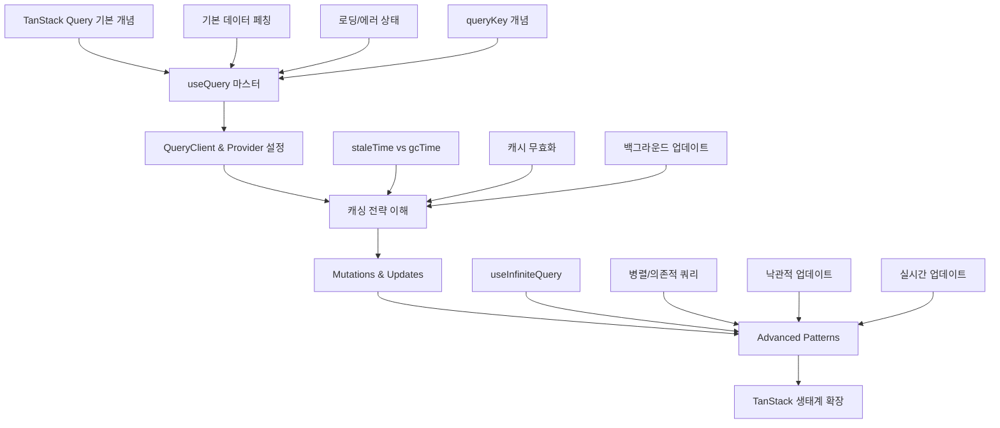

# TanStack Query 학습 정리

## 개요

**TanStack Query**는 웹 애플리케이션에서 서버 상태 관리를 위한 강력한 라이브러리입니다. 이전에는 "React Query"로 알려져 있었으나, 다양한 프레임워크를 지원하면서 TanStack Query로 리브랜딩되었습니다.

## TanStack Query란?

### 1. 정체성과 역사

**TanStack Query = React Query의 새로운 이름**

```timeline
2019년: React Query 탄생 (Tanner Linsley 개발)
2022년: TanStack Query로 리브랜딩
현재: React, Vue, Svelte, Solid, Angular 등 지원
```

**리브랜딩 이유:**
- **React 전용 → 프레임워크 중립적**: 다양한 프레임워크 지원
- **TanStack 생태계**: Query, Table, Router, Form 등 통합 라이브러리 패밀리로 확장

### 2. TanStack 생태계

**TanStack = Tanner Linsley가 만든 오픈소스 라이브러리 생태계**

**주요 라이브러리들:**
- **TanStack Query** - 서버 상태 관리 (데이터 페칭, 캐싱)
- **TanStack Table** - 강력한 테이블/데이터그리드
- **TanStack Router** - 타입 안전한 라우터
- **TanStack Virtual** - 가상화 (무한스크롤, 대용량 리스트)
- **TanStack Form** - 폼 상태 관리

**현재 프로젝트에서 사용 중:**
```json
{
  "dependencies": {
    "@tanstack/react-query": "^5.83.0",    // 서버 상태 관리
    "@tanstack/react-virtual": "^3.13.12"  // 가상화 (무한스크롤용)
  }
}
```

## TanStack Query의 핵심 미션

### 1. 서버 상태 관리의 복잡성 해결

**🎯 핵심 미션**: "서버 상태 관리의 복잡함을 해결"

**클라이언트 상태 vs 서버 상태:**
```typescript
// 클라이언트 상태 (useState, Zustand, Redux 등으로 관리)
const [isModalOpen, setIsModalOpen] = useState(false);
const [currentTheme, setCurrentTheme] = useState('dark');
const [userPreferences, setUserPreferences] = useState({});

// 서버 상태 (TanStack Query로 관리)
const { data: users } = useQuery({
  queryKey: ['users'],
  queryFn: fetchUsers,
});
```

**현대 웹 개발의 패러다임 변화:**
```
전통적 방식: 클라이언트 상태 = 서버 상태 (Redux 등으로 모두 관리)
현대적 방식: 클라이언트 상태 ≠ 서버 상태 (각각 전용 도구 사용)
```

### 2. 기존 방식의 문제점

**❌ 전통적인 서버 상태 관리 (Redux/MobX 등):**
```typescript
// 복잡한 보일러플레이트 코드
const userSlice = {
  loading: false,
  data: null,
  error: null,
  lastFetched: null,
  // + 캐싱 로직
  // + 재시도 로직  
  // + 백그라운드 업데이트 로직
  // + 중복 요청 방지 로직
  // + 에러 처리 로직
  // 모두 수동으로 구현해야 함
}

// 액션과 리듀서
const fetchUsersStart = () => ({ type: 'FETCH_USERS_START' });
const fetchUsersSuccess = (users) => ({ type: 'FETCH_USERS_SUCCESS', payload: users });
const fetchUsersError = (error) => ({ type: 'FETCH_USERS_ERROR', payload: error });

// 컴포넌트에서 사용
function UsersComponent() {
  const dispatch = useDispatch();
  const { loading, data, error } = useSelector(state => state.users);
  
  useEffect(() => {
    dispatch(fetchUsersStart());
    fetchUsers()
      .then(users => dispatch(fetchUsersSuccess(users)))
      .catch(error => dispatch(fetchUsersError(error)));
  }, [dispatch]);
  
  // 캐싱, 재시도, 백그라운드 업데이트는 별도 구현 필요
}
```

### 3. TanStack Query 해결책

**✅ TanStack Query 방식:**
```typescript
// 선언적이고 간단한 서버 상태 관리
function UsersComponent() {
  const { data, isLoading, error, refetch } = useQuery({
    queryKey: ['users'],
    queryFn: fetchUsers,
    // 캐싱, 재시도, 백그라운드 업데이트 모두 자동!
  });
  
  if (isLoading) return <div>Loading...</div>;
  if (error) return <div>Error: {error.message}</div>;
  
  return (
    <div>
      {data.map(user => <div key={user.id}>{user.name}</div>)}
      <button onClick={() => refetch()}>새로고침</button>
    </div>
  );
}
```

## 주요 기능과 특징

### 1. 자동 제공되는 핵심 기능들

**🚀 Zero Configuration 자동 기능:**
- **자동 캐싱**: 한 번 요청한 데이터는 메모리에 캐시
- **백그라운드 업데이트**: 설정된 시간(staleTime) 후 자동 재요청
- **중복 요청 제거**: 동일한 queryKey 요청 시 한 번만 실행
- **상태 동기화**: API 데이터 변경 시 모든 관련 컴포넌트 자동 업데이트
- **낙관적 업데이트**: UI 먼저 업데이트, 실패 시 롤백
- **로딩/에러 상태 자동 관리**: 반복적인 상태 관리 코드 제거
- **자동 가비지 컬렉션**: 사용하지 않는 캐시 자동 정리
- **요청 취소**: 컴포넌트 언마운트 시 진행 중인 요청 자동 취소

### 2. 고급 기능들

**📡 Advanced Data Fetching:**
- **병렬 쿼리**: 여러 API를 동시에 호출
- **의존적 쿼리**: 이전 쿼리 결과에 따라 다음 쿼리 실행
- **무한 스크롤**: `useInfiniteQuery`로 페이지네이션 처리
- **실시간 쿼리**: 폴링과 실시간 업데이트
- **Mutations**: 데이터 생성/수정/삭제 작업

**🔧 Developer Experience:**
- **전용 개발자 도구**: React DevTools 확장
- **TypeScript 완전 지원**: 타입 안전성 보장
- **Suspense 지원**: React 18 동시성 기능 활용
- **SSR/SSG 지원**: Next.js 등과 완벽 호환

## 프레임워크 지원

### 1. 2024년 현재 지원 프레임워크

**✅ 공식 지원:**
- **React** (가장 성숙, 기능 완전)
- **Vue** 
- **Svelte**
- **Solid**
- **Angular**

**사용법 비교:**
```typescript
// React
import { useQuery } from '@tanstack/react-query'
const { data, isLoading } = useQuery({ queryKey: ['users'], queryFn: fetchUsers });

// Vue
import { useQuery } from '@tanstack/vue-query'
const { data, isLoading } = useQuery({ queryKey: ['users'], queryFn: fetchUsers });

// Svelte
import { createQuery } from '@tanstack/svelte-query'
const query = createQuery({ queryKey: ['users'], queryFn: fetchUsers });
```

### 2. 프레임워크별 특징

| 프레임워크 | 성숙도 | 특징 |
|------------|---------|------|
| React | ⭐⭐⭐⭐⭐ | 가장 완전한 기능, 최신 업데이트 우선 |
| Vue | ⭐⭐⭐⭐ | Composition API 완벽 지원 |
| Svelte | ⭐⭐⭐ | 경량화된 API |
| Solid | ⭐⭐⭐ | 반응성 시스템과 완벽 통합 |
| Angular | ⭐⭐ | 비교적 새로운 지원 |

## 현실적 사용 통계와 채택률

### 1. 시장 점유율 (2024년 기준)

**📊 사용 통계:**
- **GitHub 스타**: 40,000+ ⭐
- **주간 NPM 다운로드**: 4,000,000+ 회
- **월간 활성 사용자**: 수백만 명

**🏢 사용 기업들:**
- Netflix
- Microsoft
- Google
- Airbnb
- Discord
- Spotify

### 2. React 생태계에서의 위치

**React 상태 관리 라이브러리 순위 (2024):**
1. **TanStack Query** - 서버 상태 관리 부문 1위
2. **Zustand** - 클라이언트 상태 관리 급상승
3. **Redux Toolkit** - 전통적 강자, 여전히 널리 사용
4. **Jotai** - 아토믹 상태 관리

## 실제 프로젝트에서의 활용

### 1. 현재 프로젝트 사용 예시

**기본 설정:**
```typescript
// App.tsx
import { QueryClient, QueryClientProvider } from '@tanstack/react-query';

const queryClient = new QueryClient();

function App() {
  return (
    <QueryClientProvider client={queryClient}>
      <YourComponents />
    </QueryClientProvider>
  );
}
```

**실제 사용 (CachingPage.tsx):**
```typescript
const { data, isLoading, isError, error, refetch } = useQuery<DataItem[], Error>({
  queryKey: ['caching-data', simulateError],
  queryFn: async () => {
    const result = await (simulateError ? fetchDataWithError() : fetchData());
    return result;
  },
  staleTime: 30 * 1000,              // 30초간 신선
  gcTime: 10 * 60 * 1000,            // 10분간 캐시 유지
  retry: simulateError ? 2 : 1,       // 조건부 재시도
  refetchOnWindowFocus: false,        // 창 포커스 재요청 비활성화
});
```

### 2. 일반적인 사용 패턴

**목록 + 상세 페이지:**
```typescript
// 사용자 목록 페이지
const UsersPage = () => {
  const { data: users } = useQuery({
    queryKey: ['users'],
    queryFn: fetchUsers,
  });
};

// 사용자 상세 페이지  
const UserDetailPage = ({ userId }) => {
  const { data: users } = useQuery({
    queryKey: ['users'],        // 같은 키 → 캐시 공유
    queryFn: fetchUsers,
  });
  
  const user = users?.find(u => u.id === userId);
};
```

**Mutations (데이터 변경):**
```typescript
const createUserMutation = useMutation({
  mutationFn: createUser,
  onSuccess: () => {
    // 사용자 목록 캐시 무효화 및 재요청
    queryClient.invalidateQueries({ queryKey: ['users'] });
  },
});

const handleCreateUser = (userData) => {
  createUserMutation.mutate(userData);
};
```

## 학습 경로와 발전 단계

### 1. 초급 → 고급 학습 로드맵



### 2. 단계별 학습 목표

**📚 초급 (기본기):**
- useQuery 기본 사용법
- QueryClientProvider 설정
- 로딩/에러 상태 처리
- 기본 캐싱 개념

**📖 중급 (실무 활용):**
- 캐싱 전략 (staleTime, gcTime)
- Mutations과 데이터 업데이트
- 캐시 무효화 및 동기화
- 조건부 쿼리

**📜 고급 (마스터):**
- 무한 스크롤 (useInfiniteQuery)
- 낙관적 업데이트
- 실시간 데이터 동기화
- 성능 최적화

## 현재 트렌드와 미래 전망

### 1. 2024년 주요 업데이트

**🆕 최신 기능들:**
- **React 19 완벽 지원**: 최신 React 기능과 완벽 호환
- **성능 개선**: 메모리 사용량 최적화
- **TypeScript 강화**: 더 정확한 타입 추론
- **DevTools 개선**: 더 나은 디버깅 경험

### 2. 미래 발전 방향

**🔮 로드맵:**
- **더 많은 프레임워크 지원**: Qwik, Fresh 등
- **Edge Computing 최적화**: Vercel Edge, Cloudflare Workers
- **AI 통합**: 스마트 캐싱 전략
- **Real-time 기능 강화**: WebSocket, Server-Sent Events

## 대안 라이브러리 비교

### 1. 서버 상태 관리 라이브러리 비교

| 라이브러리 | 특징 | 장점 | 단점 |
|------------|------|------|------|
| **TanStack Query** | 서버 상태 전문 | 기능 완전, 캐싱 자동화 | 학습 곡선 |
| **SWR** | Vercel 개발 | 단순함, 가벼움 | 기능 제한적 |
| **Apollo Client** | GraphQL 전용 | GraphQL 완벽 지원 | REST API 부적합 |
| **Relay** | Facebook 개발 | GraphQL 최적화 | 복잡함, 제약 많음 |

### 2. 선택 기준

**TanStack Query를 선택해야 하는 경우:**
- ✅ REST API 사용
- ✅ 복잡한 캐싱 요구사항
- ✅ 실시간 데이터 동기화 필요
- ✅ 대규모 애플리케이션
- ✅ 타입 안전성 중요

**SWR을 선택해야 하는 경우:**
- ✅ 단순한 데이터 페칭
- ✅ 번들 크기 최소화
- ✅ 빠른 프로토타이핑

## 핵심 철학과 원칙

### 1. TanStack Query의 설계 철학

**🎯 핵심 원칙:**
1. **Zero Configuration**: 기본 설정만으로도 강력함
2. **Developer Experience**: 개발자 경험 최우선
3. **Performance by Default**: 성능 최적화가 기본
4. **Framework Agnostic**: 프레임워크에 종속되지 않음
5. **Type Safety**: TypeScript 우선 설계

### 2. 해결하는 핵심 문제들

**💡 Before vs After:**

**Before (전통적 방식):**
- 수십 줄의 보일러플레이트 코드
- 수동 캐싱 및 상태 관리
- 에러 처리와 재시도 로직 직접 구현
- 중복 요청과 메모리 누수 위험
- 팀원마다 다른 데이터 페칭 패턴

**After (TanStack Query):**
- 몇 줄의 선언적 코드
- 자동 캐싱과 상태 동기화
- 내장된 에러 처리와 재시도
- 최적화된 성능과 메모리 관리
- 일관된 데이터 페칭 패턴

## 결론

**TanStack Query는 현대 웹 개발에서 서버 상태 관리의 사실상 표준**이 되었습니다. 단순한 데이터 페칭 라이브러리를 넘어서 복잡한 서버 상태 관리 문제를 우아하게 해결하는 종합 솔루션입니다.

### 핵심 가치

1. **생산성 향상**: 복잡한 서버 상태 관리를 몇 줄로 해결
2. **성능 최적화**: 자동 캐싱과 최적화로 더 빠른 앱
3. **사용자 경험**: 더 반응적이고 안정적인 UI
4. **유지보수성**: 일관된 패턴과 적은 코드량
5. **확장성**: 소규모부터 대규모까지 모든 프로젝트에 적합

### 최종 추천

**TanStack Query를 사용해야 하는 이유:**
- 🚀 **현대적**: 2024년 웹 개발 표준
- 💪 **검증됨**: 수백만 개발자가 신뢰
- 🔧 **완전함**: 서버 상태 관리의 모든 것
- 🌟 **미래지향적**: 지속적인 발전과 업데이트

현재 프로젝트에서 `@tanstack/react-query`를 사용하는 것은 매우 현명한 선택이며, 이를 통해 현대적이고 효율적인 서버 상태 관리를 경험할 수 있습니다.

**"TanStack Query = 서버 상태 관리의 게임 체인저" 🎯**