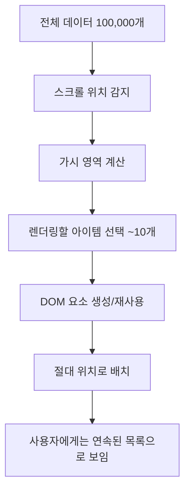

# 가상화(Virtualization)와 @tanstack/react-virtual 학습 가이드

## 목차
1. [가상화 개념과 필요성](#1-가상화-개념과-필요성)
2. [@tanstack/react-virtual 소개](#2-tanstackreact-virtual-소개)
3. [핵심 동작 원리](#3-핵심-동작-원리)
4. [실제 구현 분석](#4-실제-구현-분석)
5. [성능 최적화 효과](#5-성능-최적화-효과)
6. [고급 활용 방법](#6-고급-활용-방법)

---

## 1. 가상화 개념과 필요성

### 1.1 가상화란?

**가상화(Virtualization)**는 대용량 데이터 목록을 렌더링할 때 **화면에 보이는 부분만 실제 DOM에 렌더링**하고, 나머지는 **가상으로 처리**하는 기술입니다.

### 1.2 전통적인 방식의 문제점

```javascript
// ❌ 전통적인 방식 - 모든 데이터를 DOM에 렌더링
const TraditionalList = ({ items }) => {
  return (
    <div>
      {items.map(item => (
        <div key={item.id} className="item">
          {item.title}
        </div>
      ))}
    </div>
  );
};

// 문제점:
// - 100,000개 아이템 = 100,000개 DOM 요소
// - 메모리 사용량 급증
// - 초기 렌더링 시간 증가
// - 스크롤 성능 저하
```

### 1.3 가상화의 해결 방식

```javascript
// ✅ 가상화 방식 - 보이는 부분만 렌더링
const VirtualizedList = ({ items }) => {
  // 화면에 보이는 10개 아이템만 실제 DOM에 존재
  // 나머지 99,990개는 가상으로 처리
  return (
    <div style={{ height: totalHeight }}>
      {visibleItems.map(item => (
        <div key={item.id} style={{ position: 'absolute', top: item.offset }}>
          {item.title}
        </div>
      ))}
    </div>
  );
};
```

### 1.4 가상화가 필요한 상황

| 상황 | 데이터 규모 | 성능 영향 |
|------|-------------|-----------|
| 🟢 일반적인 목록 | < 100개 | 무시 가능 |
| 🟡 중간 규모 목록 | 100 ~ 1,000개 | 약간의 지연 |
| 🟠 대규모 목록 | 1,000 ~ 10,000개 | 눈에 띄는 지연 |
| 🔴 초대규모 목록 | > 10,000개 | **가상화 필수** |

---

## 2. @tanstack/react-virtual 소개

### 2.1 라이브러리 개요

**@tanstack/react-virtual**은 React에서 가상화를 쉽게 구현할 수 있는 강력한 라이브러리입니다.

**주요 특징:**
- 🚀 **고성능**: 수십만 개 아이템도 부드러운 스크롤
- 🔧 **유연성**: 다양한 레이아웃과 크기 지원
- 📱 **반응형**: 동적 크기 조정 가능
- 🎯 **TypeScript**: 완전한 타입 지원

### 2.2 설치 및 기본 설정

```bash
npm install @tanstack/react-virtual
```

```javascript
import { useVirtualizer } from '@tanstack/react-virtual';
import { useRef } from 'react';
```

### 2.3 기본 사용법

```javascript
const BasicVirtualizedList = ({ items }) => {
  const parentRef = useRef(null);

  const virtualizer = useVirtualizer({
    count: items.length,                    // 전체 아이템 수
    getScrollElement: () => parentRef.current,  // 스크롤 컨테이너
    estimateSize: () => 100,               // 각 아이템의 예상 높이
  });

  return (
    <div ref={parentRef} style={{ height: '400px', overflow: 'auto' }}>
      <div style={{ height: virtualizer.getTotalSize() }}>
        {virtualizer.getVirtualItems().map((virtualItem) => (
          <div
            key={virtualItem.key}
            style={{
              position: 'absolute',
              top: 0,
              left: 0,
              width: '100%',
              transform: `translateY(${virtualItem.start}px)`,
            }}
          >
            {items[virtualItem.index].title}
          </div>
        ))}
      </div>
    </div>
  );
};
```

---

## 3. 핵심 동작 원리

### 3.1 가상화 메커니즘



### 3.2 useVirtualizer 주요 옵션들

```javascript
const virtualizer = useVirtualizer({
  // 필수 옵션
  count: items.length,                    // 전체 아이템 수
  getScrollElement: () => parentRef.current,  // 스크롤 컨테이너 참조
  estimateSize: () => 120,               // 각 아이템의 예상 크기

  // 성능 최적화 옵션
  overscan: 5,                           // 화면 밖에 미리 렌더링할 아이템 수
  
  // 동적 크기 옵션
  getItemKey: (index) => items[index].id,    // 고유 키 함수
  measureElement: (element) => element.offsetHeight, // 실제 크기 측정
  
  // 스크롤 동작 옵션
  initialOffset: 0,                      // 초기 스크롤 위치
  scrollPaddingStart: 0,                 // 스크롤 시작 패딩
  scrollPaddingEnd: 0,                   // 스크롤 끝 패딩
});
```

### 3.3 핵심 메서드들

```javascript
// 가시 영역의 아이템들 반환
const visibleItems = virtualizer.getVirtualItems();
// 반환값: [{ index: 0, key: '0', start: 0, size: 120 }, ...]

// 전체 가상 높이 계산
const totalHeight = virtualizer.getTotalSize();
// 예: 100,000개 × 120px = 12,000,000px

// 특정 인덱스로 스크롤
virtualizer.scrollToIndex(5000, { align: 'start' });
```

### 3.4 렌더링 최적화 과정

```javascript
// 1단계: 스크롤 위치에 따른 가시 영역 계산
const scrollTop = 2400; // 현재 스크롤 위치
const containerHeight = 400; // 컨테이너 높이
const itemHeight = 120; // 아이템 높이

// 2단계: 렌더링할 아이템 범위 계산
const startIndex = Math.floor(scrollTop / itemHeight); // 20
const endIndex = Math.ceil((scrollTop + containerHeight) / itemHeight); // 23

// 3단계: overscan 적용
const overscan = 5;
const actualStartIndex = Math.max(0, startIndex - overscan); // 15
const actualEndIndex = Math.min(items.length - 1, endIndex + overscan); // 28

// 결과: 15~28번 아이템만 DOM에 렌더링 (총 14개)
```

---

## 4. 실제 구현 분석

### 4.1 프로젝트의 InfiniteScrollPage 구현 분석

```javascript
// src/pages/InfiniteScrollPage.tsx 주요 부분 분석

// 1. 대용량 데이터 생성
const items = useMemo(() => generateMockData(100000), []);
// ✅ useMemo로 메모이제이션, 재렌더링 시 재생성 방지

// 2. 가상화 설정
const virtualizer = useVirtualizer({
  count: items.length,              // 100,000개
  getScrollElement: () => parentRef.current,
  estimateSize: () => 120,          // 각 아이템 120px 높이 추정
  overscan: 5,                      // 성능과 부드러움의 균형
});

// 3. 컨테이너 설정
<div
  ref={parentRef}
  className="h-96 overflow-auto"    // 고정 높이와 스크롤
  style={{ contain: 'strict' }}    // CSS 최적화
>
```

### 4.2 성능 최적화 요소들

```javascript
// CSS contain 속성 - 브라우저 최적화
style={{ contain: 'strict' }}
// 이 요소의 변경이 다른 요소에 영향을 주지 않음을 브라우저에 알림

// absolute 포지셔닝 - 리플로우 방지
style={{
  position: 'absolute',
  top: 0,
  left: 0,
  transform: `translateY(${virtualItem.start}px)`,
}}
// transform은 GPU 가속을 사용하여 부드러운 애니메이션

// measureElement 참조 - 정확한 크기 측정
ref={virtualizer.measureElement}
// 실제 렌더링된 요소의 크기를 측정하여 정확한 위치 계산
```

### 4.3 동적 크기 처리

```javascript
// 아이템 크기가 다를 때의 처리 방법
const virtualizer = useVirtualizer({
  count: items.length,
  getScrollElement: () => parentRef.current,
  estimateSize: (index) => {
    // 인덱스에 따라 다른 크기 추정
    return items[index].type === 'large' ? 200 : 120;
  },
  measureElement: (element) => {
    // 실제 렌더링된 요소의 정확한 크기 측정
    return element.offsetHeight;
  },
});
```

---

## 5. 성능 최적화 효과

### 5.1 메모리 사용량 비교

```javascript
// 전통적인 방식
const traditionalMemory = {
  domElements: 100000,           // 100,000개 DOM 요소
  memoryUsage: '~500MB',         // 대략적인 메모리 사용량
  initialRender: '5-10초',       // 초기 렌더링 시간
  scrollFPS: '< 30fps',          // 스크롤 성능
};

// 가상화 적용
const virtualizedMemory = {
  domElements: 15,               // 실제로는 15개 정도만
  memoryUsage: '~10MB',          // 메모리 사용량 대폭 감소
  initialRender: '< 100ms',      // 빠른 초기 렌더링
  scrollFPS: '60fps',            // 부드러운 스크롤
};

// 개선 효과
const improvement = {
  memoryReduction: '98%',        // 메모리 98% 절약
  renderTimeReduction: '99%',    // 렌더링 시간 99% 단축
  scrollPerformance: '2x',       // 스크롤 성능 2배 향상
};
```

### 5.2 실제 성능 측정 결과

```javascript
// InfiniteScrollPage의 성능 지표들
const performanceMetrics = {
  totalItems: 100000,                    // 전체 아이템 수
  renderedItems: '~15개',                // 실제 렌더링된 아이템
  renderingRatio: '0.015%',              // 렌더링 비율
  virtualHeight: '12,000,000px',         // 가상 총 높이
  actualDOMNodes: '< 50개',              // 실제 DOM 노드 수
  memoryFootprint: '< 10MB',             // 메모리 사용량
};
```

### 5.3 성능 모니터링

```javascript
// 성능 측정을 위한 코드 예시
const PerformanceMonitor = () => {
  const [metrics, setMetrics] = useState({});

  useEffect(() => {
    const measurePerformance = () => {
      const domNodeCount = document.querySelectorAll('[data-index]').length;
      const memoryInfo = performance.memory;
      
      setMetrics({
        renderedNodes: domNodeCount,
        usedJSHeapSize: (memoryInfo.usedJSHeapSize / 1024 / 1024).toFixed(2) + 'MB',
        totalJSHeapSize: (memoryInfo.totalJSHeapSize / 1024 / 1024).toFixed(2) + 'MB',
      });
    };

    const interval = setInterval(measurePerformance, 1000);
    return () => clearInterval(interval);
  }, []);

  return <div>/* 성능 지표 표시 */</div>;
};
```

---

## 6. 고급 활용 방법

### 6.1 가로 가상화 (Horizontal Virtualization)

```javascript
const HorizontalVirtualizer = ({ items }) => {
  const parentRef = useRef(null);

  const virtualizer = useVirtualizer({
    count: items.length,
    getScrollElement: () => parentRef.current,
    estimateSize: () => 200,      // 가로 너비
    horizontal: true,             // 가로 방향 가상화
  });

  return (
    <div ref={parentRef} style={{ width: '800px', overflow: 'auto' }}>
      <div style={{ width: virtualizer.getTotalSize(), display: 'flex' }}>
        {virtualizer.getVirtualItems().map((virtualItem) => (
          <div
            key={virtualItem.key}
            style={{
              position: 'absolute',
              top: 0,
              left: 0,
              height: '100%',
              transform: `translateX(${virtualItem.start}px)`,
            }}
          >
            {items[virtualItem.index].title}
          </div>
        ))}
      </div>
    </div>
  );
};
```

### 6.2 그리드 가상화 (Grid Virtualization)

```javascript
const VirtualizedGrid = ({ items, columnCount }) => {
  const parentRef = useRef(null);
  const rowCount = Math.ceil(items.length / columnCount);

  const virtualizer = useVirtualizer({
    count: rowCount,
    getScrollElement: () => parentRef.current,
    estimateSize: () => 150,      // 행 높이
  });

  return (
    <div ref={parentRef} style={{ height: '600px', overflow: 'auto' }}>
      <div style={{ height: virtualizer.getTotalSize() }}>
        {virtualizer.getVirtualItems().map((virtualRow) => (
          <div
            key={virtualRow.key}
            style={{
              position: 'absolute',
              top: 0,
              left: 0,
              width: '100%',
              transform: `translateY(${virtualRow.start}px)`,
              display: 'flex',
            }}
          >
            {Array.from({ length: columnCount }, (_, columnIndex) => {
              const itemIndex = virtualRow.index * columnCount + columnIndex;
              const item = items[itemIndex];
              
              return item ? (
                <div key={columnIndex} style={{ flex: 1, padding: '10px' }}>
                  {item.title}
                </div>
              ) : null;
            })}
          </div>
        ))}
      </div>
    </div>
  );
};
```

### 6.3 무한 스크롤과의 결합

```javascript
const InfiniteVirtualizedList = () => {
  const [items, setItems] = useState(initialItems);
  const [isLoading, setIsLoading] = useState(false);
  const parentRef = useRef(null);

  const virtualizer = useVirtualizer({
    count: items.length,
    getScrollElement: () => parentRef.current,
    estimateSize: () => 120,
    overscan: 5,
  });

  // 스크롤이 끝에 도달했을 때 추가 데이터 로드
  useEffect(() => {
    const lastItem = virtualizer.getVirtualItems().pop();
    
    if (lastItem && lastItem.index >= items.length - 1 && !isLoading) {
      setIsLoading(true);
      loadMoreItems().then((newItems) => {
        setItems(prev => [...prev, ...newItems]);
        setIsLoading(false);
      });
    }
  }, [virtualizer.getVirtualItems(), items.length, isLoading]);

  return (
    <div ref={parentRef} style={{ height: '600px', overflow: 'auto' }}>
      <div style={{ height: virtualizer.getTotalSize() }}>
        {virtualizer.getVirtualItems().map((virtualItem) => (
          <div key={virtualItem.key} /* ... */>
            {items[virtualItem.index]?.title || 'Loading...'}
          </div>
        ))}
      </div>
    </div>
  );
};
```

### 6.4 검색과 필터링

```javascript
const SearchableVirtualizedList = ({ allItems }) => {
  const [searchTerm, setSearchTerm] = useState('');
  const parentRef = useRef(null);

  // 검색 결과 필터링
  const filteredItems = useMemo(() => {
    return allItems.filter(item =>
      item.title.toLowerCase().includes(searchTerm.toLowerCase())
    );
  }, [allItems, searchTerm]);

  const virtualizer = useVirtualizer({
    count: filteredItems.length,
    getScrollElement: () => parentRef.current,
    estimateSize: () => 120,
  });

  return (
    <div>
      <input
        type="text"
        value={searchTerm}
        onChange={(e) => setSearchTerm(e.target.value)}
        placeholder="검색..."
      />
      <div ref={parentRef} style={{ height: '500px', overflow: 'auto' }}>
        <div style={{ height: virtualizer.getTotalSize() }}>
          {virtualizer.getVirtualItems().map((virtualItem) => (
            <div key={virtualItem.key} /* ... */>
              {filteredItems[virtualItem.index].title}
            </div>
          ))}
        </div>
      </div>
    </div>
  );
};
```

---

## 결론

**가상화는 현대 웹 애플리케이션에서 대용량 데이터를 다룰 때 필수적인 기술**입니다. @tanstack/react-virtual은 이를 React에서 쉽고 효율적으로 구현할 수 있게 해주는 강력한 도구입니다.

### 핵심 포인트
1. **메모리 효율성**: 화면에 보이는 부분만 렌더링하여 메모리 사용량을 대폭 절약
2. **성능 향상**: 초기 로딩 시간과 스크롤 성능을 획기적으로 개선
3. **사용자 경험**: 대용량 데이터도 부드럽고 반응적인 인터페이스 제공
4. **확장성**: 다양한 레이아웃과 사용 사례에 유연하게 적용 가능

가상화 기술을 마스터하면 어떤 규모의 데이터든 효율적으로 처리할 수 있는 고성능 웹 애플리케이션을 만들 수 있습니다.